

{}

## art from nothing
Art using generative processes, which create images or sounds based only some input parameters, like synthesizers or algorithms.

{}

{}

## #2 – [paper.js](http://paperjs.org/about/) sketches

_just posting some old paper.js sketches from like a year ago cause I've been meaning to for a long time what do you want me to say_  
This installment of afn is various paper.js sketches exploring various ideas all with a single thing in common (or multiple, who counts); black line on a white canvas, in your web browser. _You'll see, why are you reading this text anyways._

{}



[Links to all sketches](https://einohr.codeberg.page/UNTITLED/)

## 2-1
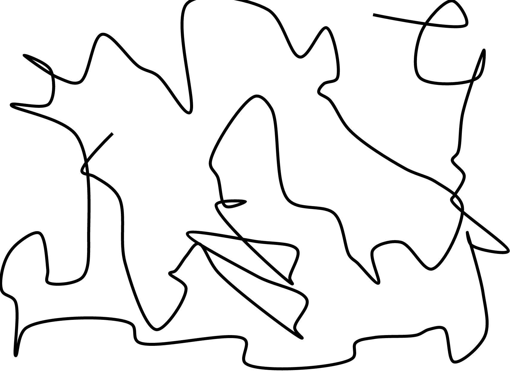
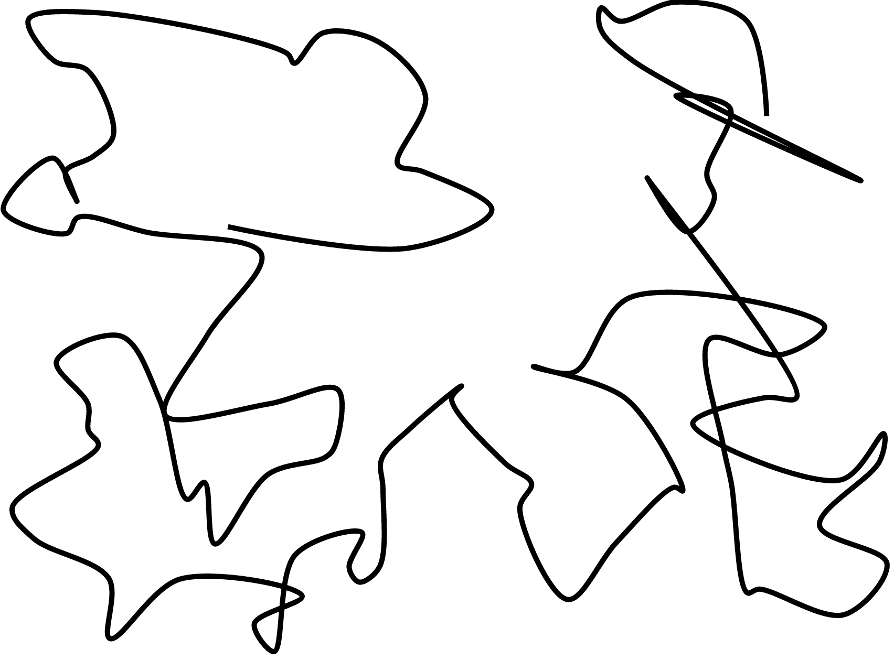

## 2-2
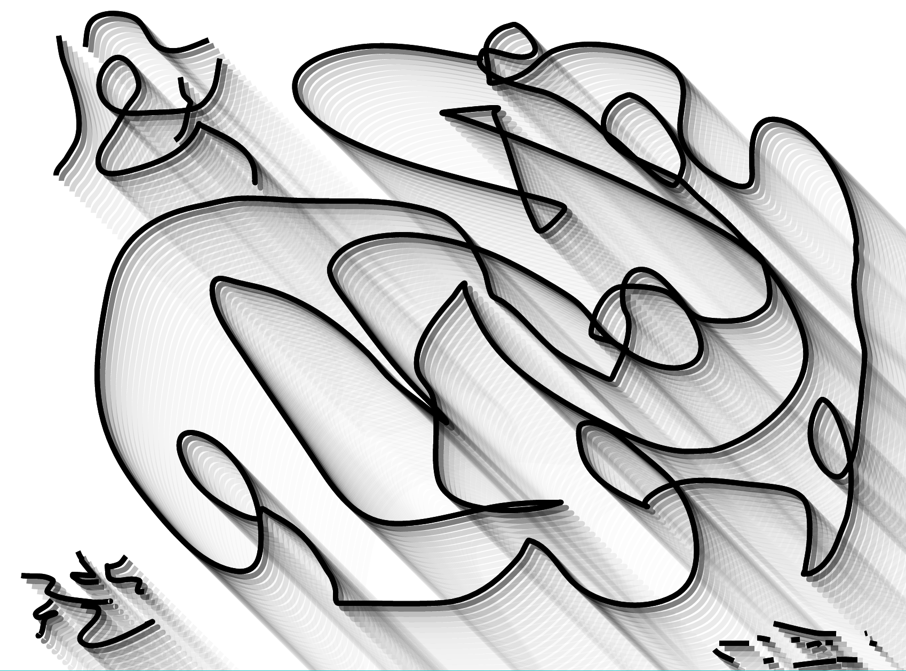

## 2-3
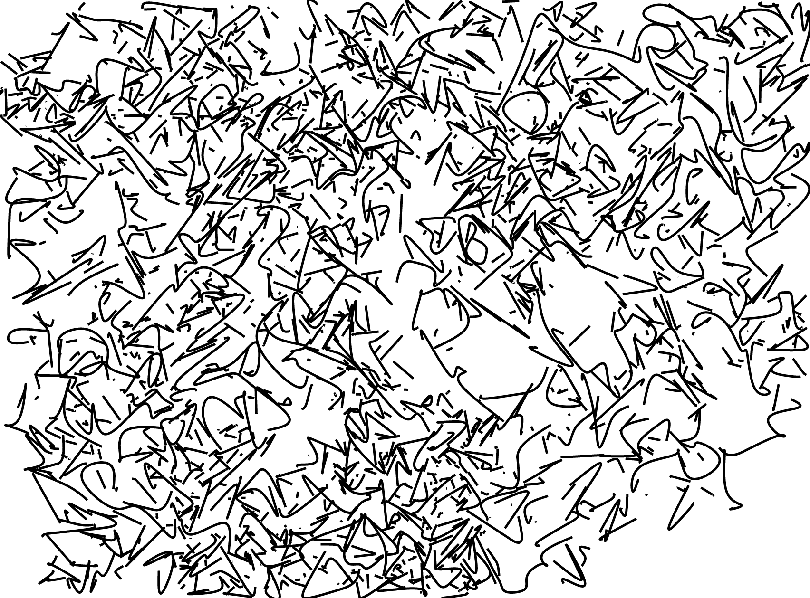
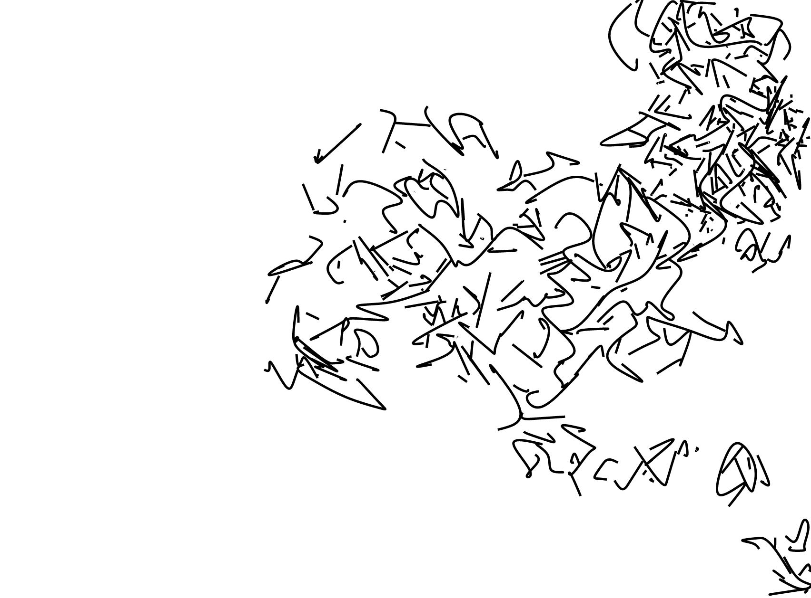
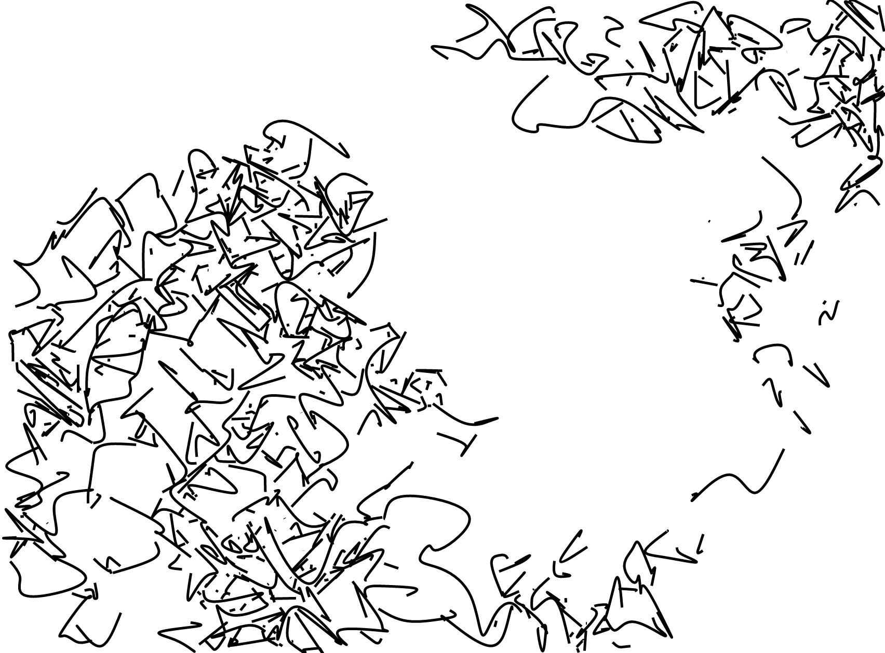

## 2-4
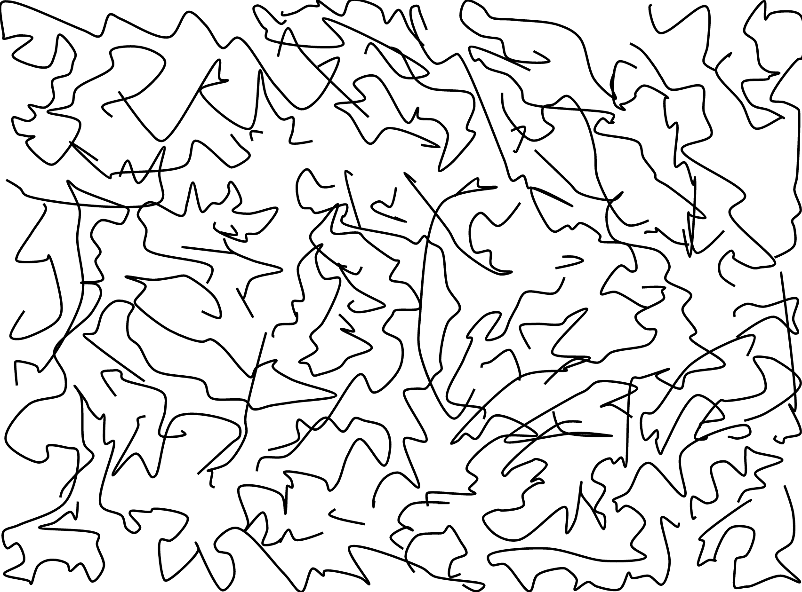
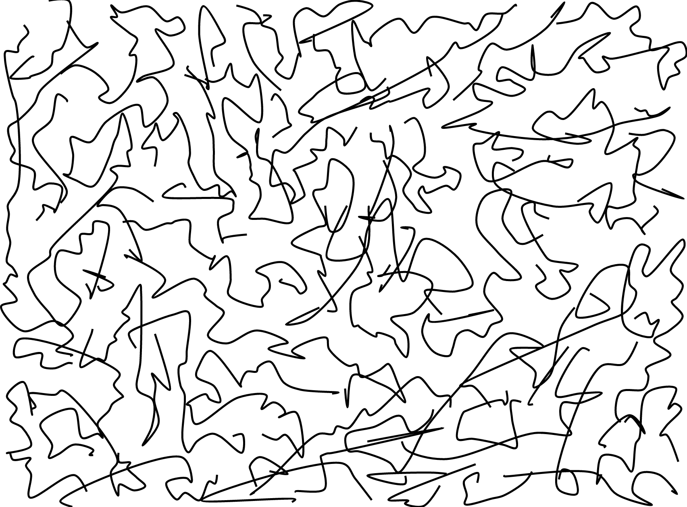

## 2-5
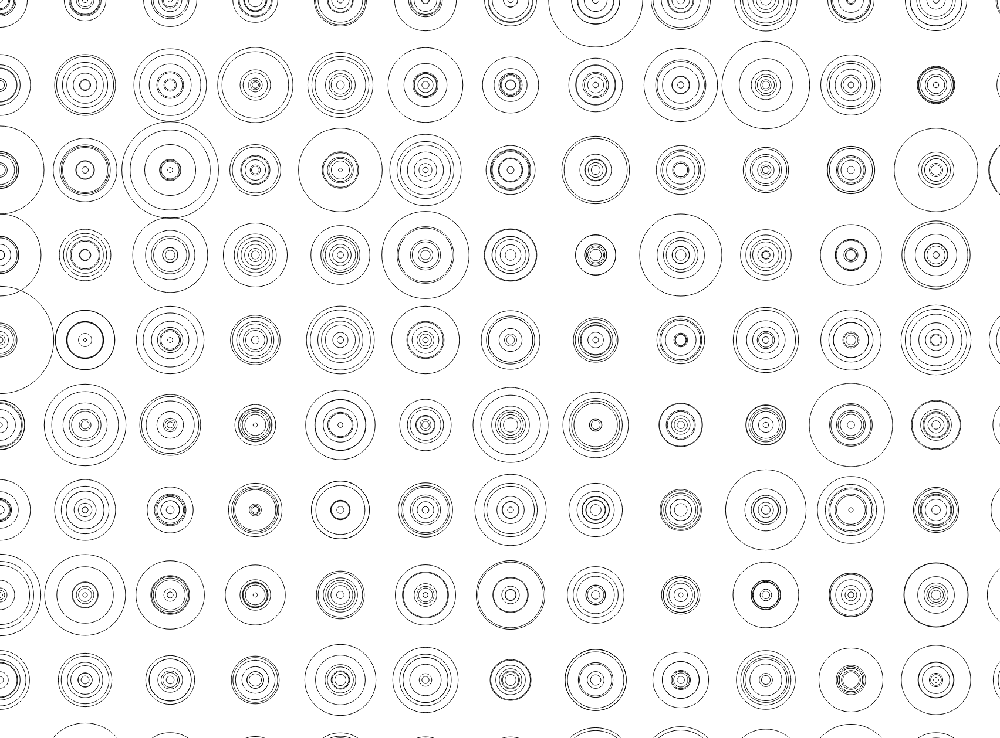
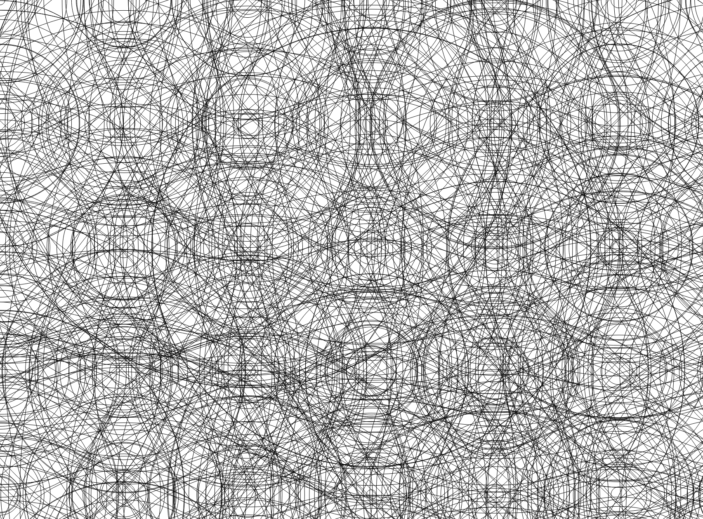
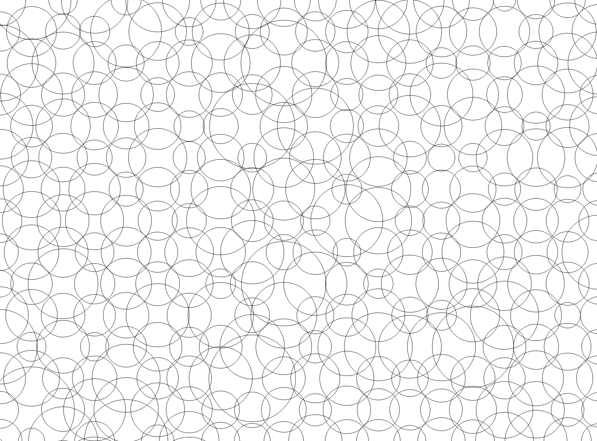

## 2-6
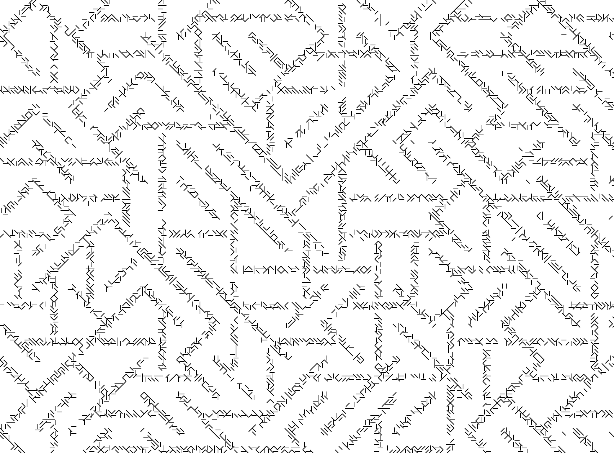

## 2-7
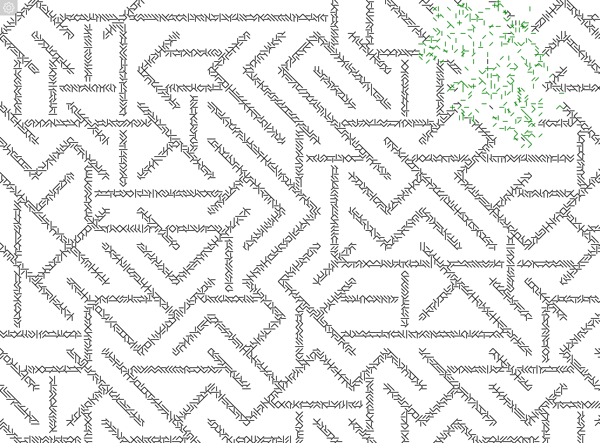