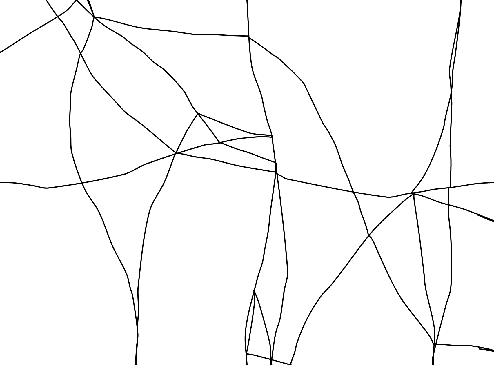



{}

## art from nothing
Art using generative processes, which create images or sounds based only some input parameters, like synthesizers or algorithms.

{}

{}

## #2 – TURTLE_PAPER

Soo, I made a small class for javascript and [paper.js](https://paperjs.org/about/), that implements [turtle graphics](https://en.wikipedia.org/wiki/Turtle_graphics)-style drawing. It's really simple, but has tons of possibilities. I liked my results so I decided to add them to this series.

{}



[Link to TURTLE_PAPER main page](https://einohr.codeberg.page/TURTLE_PAPER/)  
[Link to TURTLE_PAPER examples](https://einohr.codeberg.page/TURTLE_PAPER/examples/)

## Frontpage 0

## Frontpage 1

## Example 0

## Example 1

## Example 2

## Example 3
