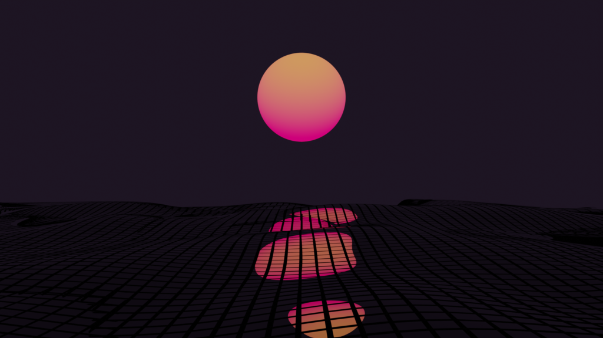


The colors are based on the Horizon VSCode theme. (<a href="https://horizontheme.netlify.app/">https://horizontheme.netlify.app/</a>) 
Originally made this just for myself in Blender but decided to publish.  


